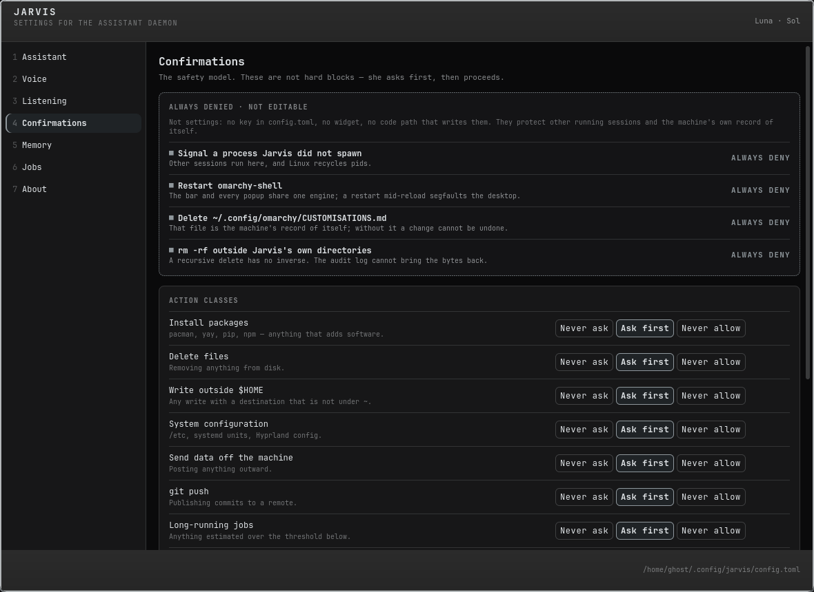

# Jarvis — settings for the Luna assistant daemon

A GTK4/PyGObject desktop app that edits `~/.config/jarvis/config.toml`, the
single source of truth `lunad` reads and hot-reloads. Seven panes, one per
section of [`docs/CONFIG-SCHEMA.md`](../docs/CONFIG-SCHEMA.md); every key in
that contract is editable here, and a test proves it.

One key in the contract is this app's own rather than the daemon's:
`[ui] theme_follows_omarchy`. `lunad` draws nothing, so it is honoured here in
`jarvis/theme.py` — on, the palette follows `omarchy theme set`; off, the
built-in monochrome palette is pinned and the theme's `colors.toml` is never
opened. The geometry tokens are deliberately outside the switch: they mirror
Hyprland's own rounding and border, and a window that stops matching every
other window is not a theme choice.



## Run it

```sh
./jarvis-settings                 # or launch "Jarvis" from the app launcher
./jarvis-settings --pane voice    # open straight to one pane, caret on its first control
./jarvis-settings --version
```

The launcher entry ships as `jarvis-settings.desktop`; install it with

```sh
cp jarvis-settings.desktop ~/.local/share/applications/
```

(`StartupWMClass=org.omarchy.jarvis`, so the launcher matches the window.) No dependencies beyond what Sill already
needs: python 3.11+ with PyGObject and GTK 4, plus `grim`/`aplay` from the base
system.

## Panes

| # | Pane | Edits |
|---|---|---|
| 1 | Assistant | `[assistant]` — name, specialist, agent, model |
| 2 | Voice | `[voice]` — provider, TTS model, both voice pickers with per-voice preview, fallback, speed, spoken-length cap |
| 3 | Listening | `[listen]` — provider, STT model, language; the keybind is **displayed, not editable** (it lives in `~/.config/hypr/bindings.lua`) |
| 4 | Confirmations | `[confirm]` + `[confirm.prompt]` — a three-way **Never ask / Ask first / Never allow** per action class, plus the four immovable denies |
| 5 | Memory | `[memory]` caps and decay, live usage bars read from `~/.local/share/luna/memory/`, and a read-only **View memories** window |
| 6 | Jobs | `[dispatch]` plus the recent job list read from `~/.local/share/luna/jobs/` |
| 7 | About | daemon status, version, whether an API key exists (never the key), links to the audit and daemon logs, and any config keys Jarvis does not recognise |

## How a change reaches the daemon

1. **Validate** against `schema.SPEC`. An invalid value never leaves the widget:
   the row marks itself and nothing is written.
2. **Apply live** with `settings.set` over `$XDG_RUNTIME_DIR/luna/luna.sock`,
   if the daemon is up *and* implements it. This is an optimisation, never the
   system of record — the About pane says plainly which of the two is in play.
3. **Persist** to `config.toml`, always. `lunad` watches the file and
   hot-reloads, so the file path works with the socket path or without it.

If the daemon is down, a banner across the top says so and offers
`systemctl --user start lunad`. That is the only process Jarvis ever starts,
and it stops or signals nothing at all except its own `aplay` preview child.

### Writing the file

Edits are **surgical**, not regenerated:

* an existing key has only its value token rewritten — indentation, the inline
  comment, and the comment's column all survive;
* a missing key is appended to the end of its own table, so key order holds;
* keys and whole tables Jarvis has never heard of are passed through untouched,
  and listed in the About pane so you can see nothing was dropped;
* the result is re-parsed and the values read back before anything is written;
  any mismatch aborts with the file unchanged;
* the write is temp-file + `os.replace`, with mode `0600` set on the temp file
  *before* the rename, inside a `0700` directory. A `.toml.bak` copy is kept.

**Secrets never live in `config.toml`.** `config.coerce` refuses any key whose
name contains a credential-ish token, and the API key is only ever reported as
present or absent — its value is never read into a variable, let alone shown.
Keys belong in `~/.config/jarvis/secrets.env`, `chmod 600`.

## Voice preview

Two buttons, because they do genuinely different things:

* **▶ Preview** (one per voice picker) plays
  `~/Music/luna-voices/deepgram_<voice>.wav` through `aplay`. That file *is*
  the picked voice, so the preview is honest even before the choice is saved.
* **Test the live pipeline** sends the daemon's `say` op, which speaks through
  whatever is currently configured — the end-to-end check.

The status line reports the exact command path taken, e.g.
`Preview: aplay sample: aplay -q /home/ghost/Music/luna-voices/deepgram_flux-sienna-en.wav`.
If a voice has no local sample, Preview falls through to the daemon and says so.

## The four immovable denies

`[confirm]` has nine editable action classes. It also has four things that are
always denied and are **not settings**: signalling a process Jarvis did not
spawn, restarting `omarchy-shell`, deleting `CUSTOMISATIONS.md`, and `rm -rf`
outside its own directories. They are rendered as **text with a reason**, not
as disabled widgets — a disabled switch is one `set_sensitive(True)` from being
editable, and these have no key in `config.toml`, no widget, and no code path
that could write them.

## Theming

Colours come from `~/.local/state/omarchy/current/theme/colors.toml`
(`background`, `foreground`, `accent`, `muted`, `selection`, plus
`hyprland_active_border` for the window chrome) and the font from
`omarchy-font-current`. Sizes come from the §6d design tokens in
`theme.py` (`FONT`, `SPACE`, `RADIUS`), never from loose pixel numbers. A test
asserts that every hex literal in the generated stylesheet is a palette value.

`omarchy theme-set` does `rm -rf current/theme && mv next current/theme`, which
destroys the directory an inner file monitor is watching — so `ThemeWatch`
watches the **stable parent** and re-arms the inner `colors.toml` monitor after
every rebuild.

## Layout

```
jarvis-settings/
  jarvis-settings        # executable entry point
  jarvis/
    app.py               # Gtk.Application, window chrome, sidebar, --pane
    panes.py             # the seven panes + the Binder that types every control
    widgets.py           # section header, separator, card, row, button, TriToggle
    theme.py             # palette -> GTK4 CSS, design tokens, ThemeWatch
    editor.py            # validate -> coalesce -> apply live -> persist
    config.py            # load / validate / atomic 0600 save
    tomledit.py          # comment-preserving TOML value replacement
    client.py            # lunad socket client, NDJSON, capability probe
    voices.py            # sample discovery, aplay preview, daemon say
    state.py             # memory / jobs / audit / key-presence readers
    schema.py            # SPEC — the contract, transcribed
  tests/                 # 53 tests, stdlib unittest
  docs/                  # pane screenshots
```

```sh
python3 -m unittest discover -s tests -t .
```

`tests/test_schema.py` parses `docs/CONFIG-SCHEMA.md` itself and fails if the
document and the GUI ever disagree about a key or a default.

## Environment

| Variable | Effect |
|---|---|
| `JARVIS_SOCKET` | Point at a different daemon socket, or a path that does not exist to exercise the daemon-down banner without stopping `lunad`. |

## Optional Hyprland rule

Jarvis is a normal tiled window. To have it float like `org.omarchy.about`,
add to `~/.config/hypr/windows.lua`:

```lua
o.window("org.omarchy.jarvis", { float = true })
o.window("org.omarchy.jarvis", { center = true })
o.window("org.omarchy.jarvis", { size = { 1180, 860 } })
```

One property per rule — Hyprland's Lua rules do not take several at once.
